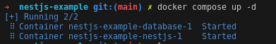
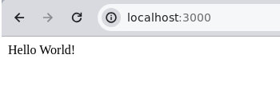
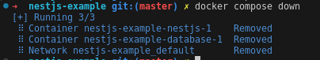

<p align="center">
  <a href="http://nestjs.com/" target="blank"></a>
</p>

[circleci-image]: https://img.shields.io/circleci/build/github/nestjs/nest/master?token=abc123def456
[circleci-url]: https://circleci.com/gh/nestjs/nest

  <p align="center">A progressive <a href="http://nodejs.org" target="_blank">Node.js</a> framework for building efficient and scalable server-side applications.</p>
    <p align="center">
<a href="https://www.npmjs.com/~nestjscore" target="_blank"></a>
<a href="https://www.npmjs.com/~nestjscore" target="_blank"></a>
<a href="https://www.npmjs.com/~nestjscore" target="_blank"></a>
<a href="https://circleci.com/gh/nestjs/nest" target="_blank"></a>
<a href="https://coveralls.io/github/nestjs/nest?branch=master" target="_blank"></a>
<a href="https://discord.gg/G7Qnnhy" target="_blank"></a>
<a href="https://opencollective.com/nest#backer" target="_blank"></a>
<a href="https://opencollective.com/nest#sponsor" target="_blank"></a>
  <a href="https://paypal.me/kamilmysliwiec" target="_blank"></a>
    <a href="https://opencollective.com/nest#sponsor"  target="_blank"></a>
  <a href="https://twitter.com/nestframework" target="_blank"></a>
</p>

## Description
This app running under nestjs framework, mongodb and opentelemetry.

## Requirement
You need docker and docker compose to run this app.

## Running the app
To run this app, just run docker compose command
```bash
#RUN THIS APP JUST RUN
docker compose up -d
```

You can access the apps on http://localhost:3000 after few minutes.

## Stopping the app
```bash
docker compose down
```

## To run monitoring for this app 
Run signoz
first install signoz with
```bash
git clone -b main https://github.com/SigNoz/signoz.git && cd signoz/deploy/\n
./install.sh
```
then in that directory run docker compose up to start signoz monitoring
```bash
docker compose up
```
After that you can open http://localhost:3301 and then access mynestjsapp


## Monitoring suggestion
Preferably add grafana to monitor instance and container process where this dockerized app running.  
For monitoring usually i create alert after CPU / RAM reach 75% or more than 5 error rate per minute.
## Support

Nest is an MIT-licensed open source project. It can grow thanks to the sponsors and support by the amazing backers. If you'd like to join them, please [read more here](https://docs.nestjs.com/support).

## Resource

- Monitor Nestjs - [Monitor Nestjs](https://medium.com/@nhanngt/how-to-monitor-your-nestjs-application-968808b79432)

## License

Nest is [MIT licensed](LICENSE).
